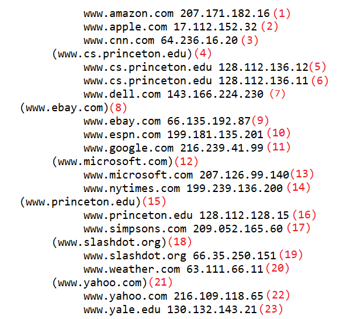
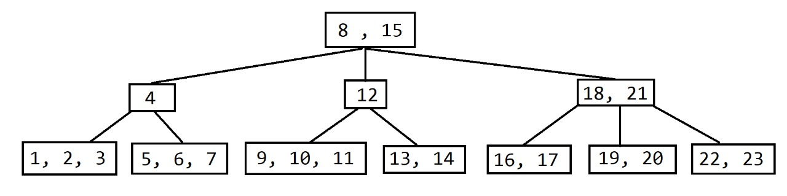
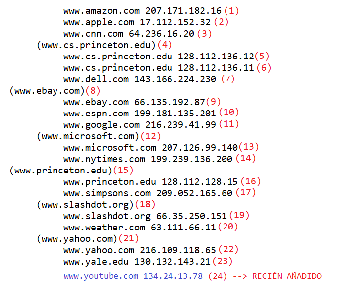
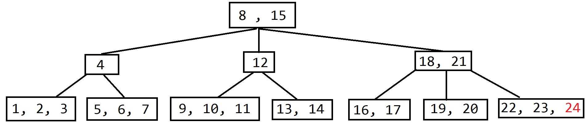

<table>
    <theader>
        <tr>
            <td></td>
            <th>
                UNIVERSIDAD NACIONAL DE SAN AGUSTIN 
                FACULTAD DE INGENIERÍA DE PRODUCCIÓN Y SERVICIOS 
                DEPARTAMENTO ACADÉMICO DE INGENIERÍA DE SISTEMAS E INFORMÁTICA 
                ESCUELA PROFESIONAL DE INGENIERÍA DE SISTEMAS
            </th>
            <td></td>
        </tr>
    </theader>
    <tbody>
        <tr><td colspan="3">Formato: Guía de Práctica de Laboratorio</td></tr>
        <tr><td>Aprobación:  2022/03/01</td><td>Código: GUIA-PRLD-001</td><td>Página: 1</td></tr>
    </tbody>
</table>

GUÍA DE LABORATORIO 

<table>
<theader>
<tr><th colspan="6">INFORMACIÓN BÁSICA</th></tr>
</theader>
<tbody>
<tr><td>ASIGNATURA:</td><td colspan="5">Estructura de Datos y Algoritmos</td></tr>
<tr><td>TÍTULO DE LA PRÁCTICA:</td><td colspan="5">Árbol B</td></tr>
<tr>
<td>NÚMERO DE PRÁCTICA:</td><td>06</td><td>AÑO LECTIVO:</td><td>2022 A</td><td>NRO. SEMESTRE:</td><td>III</td>
</tr>
<tr>
<td>FECHA INICIO::</td><td>03-Agosto-2022</td><td>FECHA FIN:</td><td>07-Agosto-2022</td><td>DURACIÓN:</td><td>02 horas</td>
</tr>
<tr><td colspan="6">INTEGRANTES:
    <ul>
        <li>Durand Obando, Eduardo Franshua</li>
        <li>Integrante 2</li>
        <li>Integrante 3</li>
        <li>Integrante 4</li>
</td>
</<tr>
<tr><td colspan="6">DOCENTES:
<ul>
<li>Richart Smith Escobedo Quispe - rescobedoq@unsa.edu.pe</li>
</ul>
</td>
</<tr>
</tdbody>
</table>

# Árboles

[![License][license]][license-file]
[![Downloads][downloads]][releases]
[![Last Commit][last-commit]][releases]

[![Debian][Debian]][debian-site]
[![Git][Git]][git-site]
[![GitHub][GitHub]][github-site]
[![Vim][Vim]][vim-site]
[![Java][Java]][java-site]

#

## OBJETIVOS TEMAS Y COMPETENCIAS

### OBJETIVOS

- Estudiar árbol b.

### TEMAS
-   Definiciones de árbol b.
-   Operaciones con árbol b.

## EJERCICIOS PROPUESTOS
#
-  1. Modificar el método de obtención de valor dado una clave (5 puntos)En el código, para la clave www.simpsons.com, invocado de la siguiente manera:

            System.out.println("simpsons.com: " + st.get("wwwsimpsons.com"));
        Retorna:

            simpsons.com: 209.052.165.60

        Para la clave "www.cs.princeton.edu", retorna:

            cs.princeton.edu: 128.112.136.12

        Se puede observar que se está obteniendo el valor de la primera clave encontrada.
Dado que al árbol se le ingresan dos valores:

            st.put("www.cs.princeton.edu", "128.112.136.12");

            st.put("www.cs.princeton.edu", "128.112.136.11");
        Se requiere: Modificar el código para que también pueda mostrarse todos los
        valores asociados a la clave.

#
- 2. Mostrar en un diagrama de árbol gráficamente la estructura final para los datos
ingresados. (4 puntos)

#
- 3. El método toString() del árbol, retorna lo siguiente. ¿Por qué están entre paréntesis
ciertas claves? (4 puntos)

                www.amazon.com 207.171.182.16
                www.apple.com 17.112.152.32
                www.cnn.com 64.236.16.20
            (www.cs.princeton.edu)
                www.cs.princeton.edu 128.112.136.12
                www.cs.princeton.edu 128.112.136.11
                www.dell.com 143.166.224.230
            (www.ebay.com)
                www.ebay.com 66.135.192.87
                www.espn.com 199.181.135.201
                www.google.com 216.239.41.99
            (www.microsoft.com)
                www.microsoft.com 207.126.99.140
                www.nytimes.com 199.239.136.200
            (www.princeton.edu)
                www.princeton.edu 128.112.128.15
                www.simpsons.com 209.052.165.60
            (www.slashdot.org)
                www.slashdot.org 66.35.250.151
                www.weather.com 63.111.66.11
            (www.yahoo.com)
                www.yahoo.com 216.109.118.65
                www.yale.edu 130.132.143.21
                
        Mostrar paso a paso el arbol-B al eliminar " www.espn.com": (4 puntos)

#
- 4. Agregar un nodo adicional (www.youtube.com, 134.24.13.78) y mostrarlo paso a
paso. (3 puntos)

    **EXPLICACIÓN**

    Teniendo en cuenta que al árbol B al que le queremos agregar un nodo adicional (www.youtube.com, 134.24.13.78) tiene la siguiente forma:

    

    Donde las claves con () paréntesis representan raíces de un subárbol, además de estar ordenado de manera alfabética.

    

    Si se agrega un nuevo nodo (24) es posible confirmar que queda espacio en la posición donde corresponde, por lo que agregando el nuevo elemento el árbol queda de la siguiente manera:

    

    Puesto que youtube es el mayor de los elementos por el nombre es enviado al nodo final.
   
    

    
    

## REFERENCIAS
[1] Weiss M., Data Structures & Algorithm Analysis Using Java, 2010, Addison-Wesley.

[2] Capítulo 4. Representación de conjuntos mediante arboles, Departamento de
Informática y Sistemas Área de Lenguajes y Sistemas, Universidad de Murcia, pag.168

[3] https://www.cs.usfca.edu/~galles/visualization/BTree.html

[4] https://ccia.ugr.es/~jfv/ed1/tedi/cdrom/docs/arb_B.htm

#

[license]: https://img.shields.io/github/license/rescobedoq/pw2?label=rescobedoq
[license-file]: https://github.com/rescobedoq/pw2/blob/main/LICENSE

[downloads]: https://img.shields.io/github/downloads/rescobedoq/pw2/total?label=Downloads
[releases]: https://github.com/rescobedoq/pw2/releases/

[last-commit]: https://img.shields.io/github/last-commit/rescobedoq/pw2?label=Last%20Commit

[Debian]: https://img.shields.io/badge/Debian-D70A53?style=for-the-badge&logo=debian&logoColor=white
[debian-site]: https://www.debian.org/index.es.html

[Git]: https://img.shields.io/badge/git-%23F05033.svg?style=for-the-badge&logo=git&logoColor=white
[git-site]: https://git-scm.com/

[GitHub]: https://img.shields.io/badge/github-%23121011.svg?style=for-the-badge&logo=github&logoColor=white
[github-site]: https://github.com/

[Vim]: https://img.shields.io/badge/VIM-%2311AB00.svg?style=for-the-badge&logo=vim&logoColor=white
[vim-site]: https://www.vim.org/

[Java]: https://img.shields.io/badge/java-%23ED8B00.svg?style=for-the-badge&logo=java&logoColor=white
[java-site]: https://docs.oracle.com/javase/tutorial/

[![Debian][Debian]][debian-site]
[![Git][Git]][git-site]
[![GitHub][GitHub]][github-site]
[![Vim][Vim]][vim-site]
[![Java][Java]][java-site]

[![License][license]][license-file]
[![Downloads][downloads]][releases]
[![Last Commit][last-commit]][releases]
